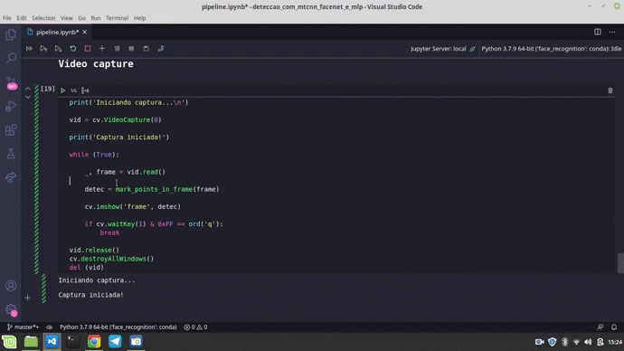

---

<h1 align="center">
  Detecção de Máscara em Python Usando OpenCV e Deep Learning
</h1>

  
  
  

---

## :smiley: Sobre o repositório

Neste respositório, compartilho uma aplicação que eu desenvolvi para detecção de máscara em tempo real, utilizando OpenCV-Python e modelos de Deep Learning. Detalhei o desenvolvimento deste projeto em dois artigos no Medium, inclusive, te convido a dar uma lida: [Detecção de Máscara em Python Usando OpenCV e Deep Learning - Parte 1/2](https://vitoria-carvalho.medium.com/detec%C3%A7%C3%A3o-de-m%C3%A1scara-em-python-usando-opencv-e-deep-learning-parte-1-2-92c66799934e) e [Detecção de Máscara em Python Usando OpenCV e Deep Learning - Parte 2/2](https://vitoria-carvalho.medium.com/detec%C3%A7%C3%A3o-de-m%C3%A1scara-em-python-usando-opencv-e-deep-learning-parte-2-2-ee65644bb9d5). Nesses artigos, expliquei passo a passo o projeto e da implementação, desde a escolha das tecnologias até os resultados finais :)

  

---

## :mask: Motivação

Em virtude do cenário de pandemia, diversas soluções computacionais têm sido propostas para apoiar as autoridades no controle das medidas restritivas, como por exemplo a detecção de máscara em tempo real. Os algoritmos de detecção de máscara podem ser utilizados em sistemas embarcados presentes em câmeras de supermercados, shoppings, aeroportos, hospitais, escolas e outros ambientes que acomodam um grande número de pessoas.

A ideia deste projeto foi desenvolver um algoritmo para detecção facial utilizando a biblioteca OpenCV e técnicas de Deep Learning. Espero que, compartilhando meu aprendizado, consiga te ajudar de alguma maneira \o/

---

## :rocket: Tecnologias utilizadas

Foram utilizadas as seguintes tecnologias no desenvolvimento do projeto:

- Python
- OpenCV
- MTCNN
- FaceNet
- MLP

---

## :computer: Execução da aplicação

Inicialmente, clone este repositório executando:

    git clone https://github.com/VitoriaCarvalho/MaskDetection.git
    
Antes de iniciar a instalação dos pacotes, te aconselho a criar um ambiente virtual para que os pacotes dessa implementação em nada interfiram com seu ambiente padrão. Com o anaconda, você consegue criar um ambiente facilmente:

    conda create - name myenv
    conda activate myenv
    
Com o ambiente criado, navegue para o diretório onde você clonou o repositório e execute o comando abaixo para instalar os pacotes necessários com o pip:

    pip install -r requirements.txt
    
Se tudo ocorreu bem até aqui, agora você já pode executar os códigos :)

**Observação 1:** se você deseja executar o código de extração de características da base de imagens para treinar o modelo novamente, basta abrir o jupyter notebook ou o vs code dentro do diretório onde você clonou o repositório e acessar o notebook `feature_extraction_and_classification.ipynb`.

**Observação 2:** se você deseja executar apenas a aplicação final, onde os modelos são carregados e a detecção é feita na captura de vídeo, é totalmente possível, pois já disponibilizei os modelos treinados aqui no repositório. Basta abrir o jupyter notebook ou o vs code dentro do diretório onde você clonou o repositório e acessar o notebook `pipeline.ipynb`.

Nos dois casos, lembre-se de selecionar o kernel referente ao ambiente conda que você criou! :smiley:

Se tudo der certo com a execução, a OpenCV iniciará a captura dos frames da sua webcam ou vídeo e a detecção começará automaticamente, como no exemplo abaixo:

  

---

## :pencil: Ideias de implementações futuras no algoritmo

No segundo post que eu escrevi no Medium sobre esse projeto, mencionei alguns aspectos onde a aplicação poderia melhorar:

* Seria interessante adicionar mais imagens na base de treino, imagens capturadas pela própria OpenCV. Você poderia iniciar a captura de vídeo e salvar os frames alternando entre o uso e o não uso de máscara. Com essa base de treino incrementada, você pode treinar o classificador novamente;
* Depois de adicionar novas imagens, seria legal executar um algoritmo de otimização de hiper parâmetros no classificador, como o Grid Search;
* Dependendo dos resultados alcançados com os itens anteriores, você também poderia variar o limiar de confiança que eu atribuí na classificação até encontrar um novo valor ideal;
* Eu testei outras abordagens alternativas de extração e classificação de características. Mas você conhece alguma outra abordagem mais otimizada que talvez proporcione melhores resultados? Se sim, vale a pena testar! :muscle::clap:

---

## :muscle: Como contribuir

- Faça um fork desse repositório;
- Crie uma branch com a sua feature: `git checkout -b minha-feature`;
- Faça commit das suas alterações: `git commit -m 'feat: Minha nova feature'`;
- Faça push para a sua branch: `git push origin minha-feature`.

---

## :bulb: Inspirações

Antes de colocar a mão na massa, eu tive várias ideias depois de assistir alguns cursos muito legais, que não poderia deixar de recomendá-los aqui: [Reconhecimento Facial Descomplicado](https://youtube.com/playlist?list=PLbmt8d_ueDMWy8tXfsIlgOvVjyLoCAYsF), [Detector de Máscara com Deep Learning](https://youtu.be/PT45jhlQD7M) e [Detector de Máscaras com Python](https://iaexpert.academy/conteudo-assinatura/detector-de-mascaras-com-python/). Obrigada por ajudarem a comunidade com conteúdos de qualidade, gratuitos e em português <3

## :memo: Licença

Esse projeto está sob a licença MIT. Veja o arquivo [LICENSE](https://github.com/VitoriaCarvalho/MaskDetection/blob/master/LICENSE) para mais detalhes.

---

Desenvolvido com :purple_heart: por <a href="https://www.linkedin.com/in/vit%C3%B3ria-carvalho-90210b19a/">Vitória Carvalho :woman::computer:</a>

---
